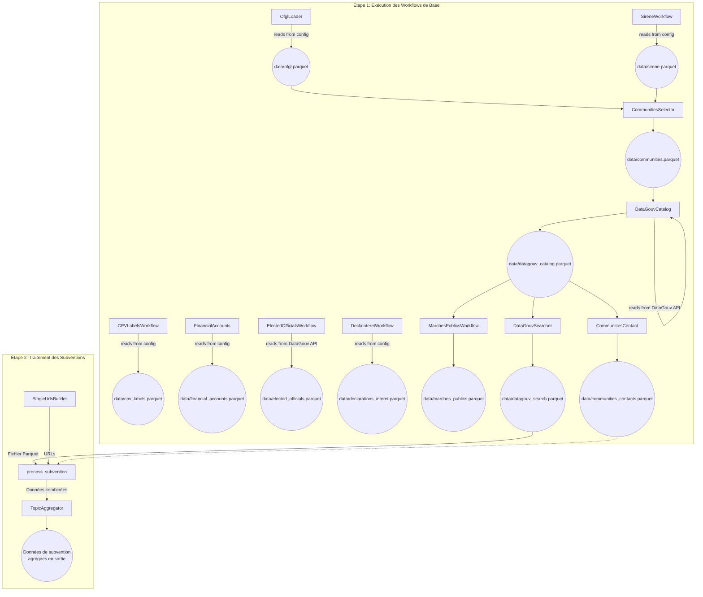

# Pipeline d'intégration des données

L'intégralité du contenu du dossier `./back/` concerne la partie backend du projet.


## Table des matières

- [Pipeline d'intégration des données](#pipeline-dintégration-des-données)
  - [Table des matières](#table-des-matières)
  - [Structure du back](#structure-du-back)
  - [Flux de Données](#flux-de-données)
  - [Contribuer](#contribuer)
    - [Acces Repo](#acces-repo)
    - [Environnement de développement](#environnement-de-développement)
      - [Installation de Poetry avec pipx](#installation-de-poetry-avec-pipx)
      - [Installation de Poetry avec le depot officiel](#installation-de-poetry-avec-le-depot-officiel)
      - [Utiliser Poetry](#utiliser-poetry)
      - [Utiliser un venv python](#utiliser-un-venv-python)
  - [Lancer les precommit hook localement](#lancer-les-precommit-hook-localement)
  - [Utiliser Tox pour tester votre code](#utiliser-tox-pour-tester-votre-code)
  - [Executer PostgreSQL localement avec docker](#executer-postgresql-localement-avec-docker)
    - [Installer docker](#installer-docker)
    - [Démarrer une instance](#démarrer-une-instance)
  - [Lancer le script](#lancer-le-script)
    - [Sur des données de test](#sur-des-données-de-test)
    - [Sur l'ensemble des données](#sur-lensemble-des-données)
  - [Licenses](#licenses)
    - [Code](#code)
    - [Données et Analyses](#données-et-analyses)


## Structure du back

- `data/`: dossier pour stocker les données du projet, organisées en sous-dossiers

    - `communities/`: informations sur les collectivités
    - `datasets/`: données récupérées et filtrées
    - `processed_data/`: données traitées et prêtes pour l'analyse
- `scripts/`: dossier pour les scripts Python du projet, organisés en sous-dossiers
    - `workflow/` : script gérant le workflow général
    - `communities/`: scripts pour la gestion des collectivités
    - `datasets/`: scripts pour le scrapping et le filtrage des données
    - `data_processing/`: scripts pour le traitement des données
    - `analysis/`: scripts pour l'analyse des données (vide à date)
    - `loaders/`: scripts de téléchargement de fichiers
    - `utils/`: scripts utilitaires et helpers
- `main.py`: script principal pour exécuter les scripts du projet
- `config.yaml`: fichier de configuration pour faire tourner `main.py`.
 - `.gitignore`: fichier contenant les références ignorées par git
- `README.md`: ce fichier


## Flux de Données

Le diagramme suivant illustre le flux de traitement des données orchestré par le script `workflow_manager.py`.

### Étape 1: Exécution des Workflows de Base

#### Workflows Indépendants

1.  **`CPVLabelsWorkflow`**:
    *   **Rôle**: Charge les libellés CPV (Common Procurement Vocabulary).
    *   **Entrées**: Un fichier distant spécifié par `cpv_labels.url` dans la configuration.
    *   **Sortie**: `data/cpv_labels.parquet`

2.  **`SireneWorkflow`**:
    *   **Rôle**: Traite les données SIRENE pour les informations légales sur les entités françaises.
    *   **Entrées**:
        *   Un fichier zip distant depuis `sirene.url`.
        *   Plusieurs fichiers Excel distants pour les codes NAF depuis `sirene.xls_urls_naf`.
        *   Un fichier Excel distant pour les catégories juridiques depuis `sirene.xls_urls_cat_ju`.
    *   **Sortie**: `data/sirene.parquet`

3.  **`FinancialAccounts`**:
    *   **Rôle**: Agrège les comptes financiers des collectivités.
    *   **Entrées**:
        *   Un fichier CSV local (`financial_accounts.files_csv`) qui liste les fichiers de données à télécharger et à traiter.
        *   Un fichier CSV local (`financial_accounts.columns_mapping`) pour le mappage des colonnes.
    *   **Sortie**: `data/financial_accounts.parquet`

4.  **`ElectedOfficialsWorkflow`**:
    *   **Rôle**: Collecte des informations sur les élus.
    *   **Entrées**: Récupère la liste des ressources depuis l'API DataGouv pour le jeu de données `5c34c4d1634f4173183a64f1`.
    *   **Sortie**: `data/elected_officials.parquet`

5.  **`DeclaInteretWorkflow`**:
    *   **Rôle**: Traite les déclarations d'intérêts des élus.
    *   **Entrées**: Un fichier XML distant depuis `declarations_interet.url`.
    *   **Sortie**: `data/declarations_interet.parquet`

6.  **`OfglLoader`**:
    *   **Rôle**: Charge les données de l'OFGL (Observatoire des finances et de la gestion publique locales).
    *   **Entrées**: Un fichier CSV local (`ofgl.urls_csv`) contenant les URLs à télécharger.
    *   **Sortie**: `data/ofgl.parquet`

#### Workflows Dépendants

7.  **`CommunitiesSelector`**:
    *   **Rôle**: Crée une liste organisée de collectivités françaises.
    *   **Entrées**:
        *   `data/ofgl.parquet`
        *   `data/sirene.parquet`
        *   Un fichier distant pour les données ODF depuis `communities.odf_url`.
        *   Un fichier distant pour les données EPCI depuis `communities.epci_url`.
        *   Récupère les métriques géographiques depuis l'API DataGouv pour le jeu de données spécifié dans `communities.geo_metrics_dataset_id`.
    *   **Sortie**: `data/communities.parquet`

8.  **`DataGouvCatalog`**:
    *   **Rôle**: Récupère et traite l'intégralité du catalogue DataGouv.
    *   **Entrées**:
        *   `data/communities.parquet`
        *   Récupère le catalogue depuis l'API DataGouv (jeu de données `5d13a8b6634f41070a43dff3`) ou une URL directe depuis `datagouv_catalog.catalog_url`.
    *   **Sortie**: `data/datagouv_catalog.parquet`

9.  **`MarchesPublicsWorkflow`**:
    *   **Rôle**: Agrège les données des marchés publics.
    *   **Entrées**:
        *   `data/datagouv_catalog.parquet` (pour trouver les ressources du jeu de données `5cd57bf68b4c4179299eb0e9`).
        *   Un schéma JSON distant depuis `marches_publics.schema`.
    *   **Sortie**: `data/marches_publics.parquet`

10. **`DataGouvSearcher`**:
    *   **Rôle**: Recherche dans le catalogue DataGouv les jeux de données relatifs aux subventions.
    *   **Entrées**: `data/datagouv_catalog.parquet`.
    *   **Sortie**: `data/datagouv_search.parquet`

11. **`CommunitiesContact`**:
    *   **Rôle**: Récupère les informations de contact des administrations françaises.
    *   **Entrées**:
        *   `data/datagouv_catalog.parquet` (pour trouver la ressource du jeu de données `53699fe4a3a729239d206227`).
        *   Une URL directe depuis `communities_contacts.url` peut également être utilisée.
    *   **Sortie**: `data/communities_contacts.parquet`



## Contribuer

- Rappel: La contribution du projet se fait par l'intermédiaire de Data 4 Good. Il est nécessaire de se rapprocher du Slack dédié, canal 13_eclair_public, pour toutes questions.
- Pour les nouveaux arrivants: Pensez à vous présenter dans les canaux dédiés, participez aux points hebdo qui on lieu le jeudi.


### Acces Repo


``` bash
# Copier le repo en local
git clone https://github.com/dataforgoodfr/13_eclaireur_public.git
```


### Environnement de développement


> Le projet nécessite l'installation de Python 3.13 et de Poetry au minimum en version 2.


Plusieurs [méthodes d'installation](https://python-poetry.org/docs/#installation) sont décrites dans la documentation de poetry dont:

- avec pipx
- avec l'installateur officiel

Chaque méthode a ses avantages et inconvénients. Par exemple, la méthode pipx nécessite d'installer pipx au préable, l'installateur officiel utilise curl pour télécharger un script qui doit ensuite être exécuté et comporte des instructions spécifiques pour la completion des commandes poetry selon le shell utilisé (bash, zsh, etc...).

L'avantage de pipx est que l'installation de pipx est documentée pour linux, windows et macos. D'autre part, les outils installées avec pipx bénéficient d'un environment d'exécution isolé, ce qui est permet de fiabiliser leur fonctionnement. Finalement, l'installation de poetry, voire d'autres outils est relativement simple avec pipx.

Cependant, libre à toi d'utiliser la méthode qui te convient le mieux ! Quelque soit la méthode choisie, il est important de ne pas installer poetry dans l'environnement virtuel qui sera créé un peu plus tard dans ce README pour les dépendances de la base de code de ce repo git.

#### Installation de Poetry avec pipx

Suivre les instructions pour [installer pipx](https://pipx.pypa.io/stable/#install-pipx) selon ta plateforme (linux, windows, etc...)

Par exemple pour Ubuntu 23.04+:

    sudo apt update
    sudo apt install pipx
    pipx ensurepath

Pour macos:

    brew install pipx
    pipx ensurepath

[Installer Poetry avec pipx](https://python-poetry.org/docs/#installing-with-pipx):

    pipx install poetry


#### Installation de Poetry avec le depot officiel

L'installation avec l'installateur officiel nécessitant quelques étapes supplémentaires,
se référer à la [documentation officielle](https://python-poetry.org/docs/#installing-with-the-official-installer).


#### Utiliser Poetry

``` bash
# Installer les dépendances
poetry install
# Mettre à jour les dépendances
poetry update
```


#### Utiliser un venv python

<span style="color: darkred;">Si vous préférez utiliser un venv python, suivez les instructions suivantes:</span>

``` bash
python3 -m venv .venv
source .venv/bin/activate
# Il vous sera necessaire de vous assurer d'installer les dépendances requises, poetry ne générant pas de requirements.txt par défaut.
# Actuellement, aucun support n'est proposé pour les venv python.
```


## Lancer les precommit hook localement

[Installer les precommit](https://pre-commit.com/)
``` bash
pre-commit run --all-files
```


## Utiliser Tox pour tester votre code
``` bash
tox -vv
```

## Executer PostgreSQL localement avec docker
Par défaut, le script sauvegarde ses résultats dans une base PostgreSQL locale. Il est donc nécésaire d'éxécuter localement une instance, ce qu'il est possible de faire avec docker.

> Vous pouvez désactiver cette fonctionnalité en changeant `workflow.save_to_db: False` dans la config.

### Installer docker
Se reporter à la [documentation](https://docs.docker.com/engine/install/) docker.

### Démarrer une instance
Depuis un terminal:

    docker compose -f docker-compose.yaml up -d

## Lancer le script
### Sur des données de test

    poetry run python back/main.py -f back/config-test.yaml

### Sur l'ensemble des données

    poetry run python back/main.py


## Licenses

### Code

The code in this repository is licensed under the [MIT License](./../LICENSE)

### Données et Analyses

Sauf indication contraire, les données et analyses de ce dépôt sont sous licence [Creative Commons Attribution 4.0 International (CC BY 4.0)](https://creativecommons.org/licenses/by/4.0/).
